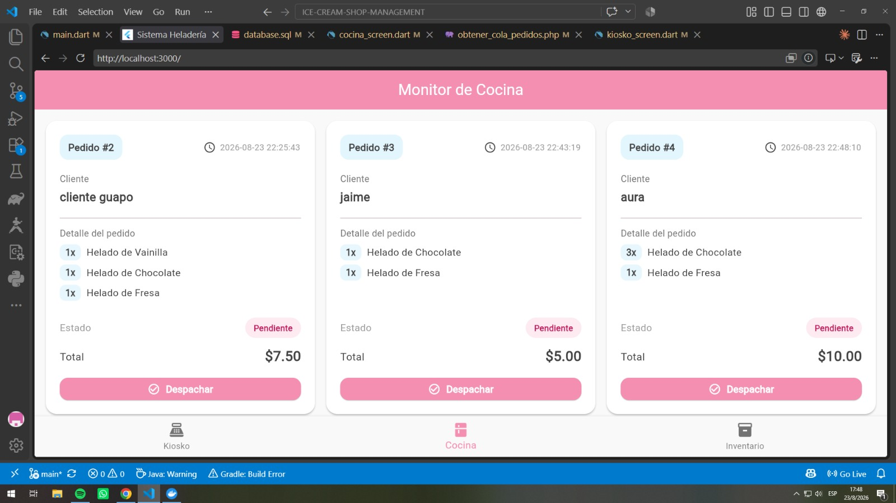

 # Sistema de gestión para heladería

Aplicación para administrar las ventas y la operación diaria de una heladería. El proyecto está compuesto por:

- **Frontend:** aplicación Flutter con los módulos Kiosko, Cocina e Inventario.
- **Backend:** API REST en PHP.
- **Base de datos:** MariaDB, inicializada con `database.sql`.
- **Entorno:** Docker Compose para ejecutar Apache/PHP y MariaDB.

## Precondiciones

Antes de iniciar, se necesita:

- Docker Desktop o Docker Engine instalado y abierto.
- Git, si se va a descargar Flutter mediante el script.
- Un terminal ubicado en la carpeta raíz del proyecto.
- Puertos disponibles `8080` para la API y `3307` para MariaDB.

## 1. Preparar el frontend

Desde la raíz del proyecto, ejecutar:

```bash
bash instalar_frontend.sh
source ~/.bashrc
```

El script realiza estas tareas:

1. Instala paquetes del sistema requeridos por Flutter.
2. Descarga el SDK estable de Flutter en `.flutter_sdk` si todavía no existe.
3. Agrega Flutter al `PATH` del usuario.
4. Habilita Flutter Web.
5. Crea la carpeta `frontend` si no existe.

Después, instalar las dependencias del proyecto:

```bash
cd frontend
flutter pub get
```

## 2. Configurar las variables de entorno

Docker Compose lee las credenciales de `.devcontainer/.env`. Crear ese archivo con valores locales, por ejemplo:

```env
MYSQL_ROOT_PASSWORD=root
MYSQL_DATABASE=heladeria_db
```

La API PHP también necesita `backend/.env` para conectarse a MariaDB:

```env
DB_HOST=db
DB_NAME=heladeria_db
DB_USER=root
DB_PASS=root
```

El valor de `DB_PASS` debe coincidir con `MYSQL_ROOT_PASSWORD`. Estos archivos están ignorados por Git y no deben publicarse con contraseñas reales.

## 3. Levantar el backend y la base de datos

Desde la carpeta del proyecto:

```bash
cd .devcontainer
docker compose up -d
```

Este comando:

- Levanta el servicio `app` con PHP 8.2 y Apache.
- Publica la API en `http://localhost:8080`.
- Levanta MariaDB en el servicio `db` y la expone en el puerto `3307`.
- Ejecuta `database.sql` al crear la base de datos por primera vez.
- Monta la carpeta del proyecto dentro del contenedor Apache.

Comprobar el estado de los contenedores:

```bash
docker compose ps
```

Para revisar los registros si aparece un error:

```bash
docker compose logs -f app
docker compose logs -f db
```

La URL base usada por Flutter está definida en `frontend/lib/services/api_config.dart`:
`http://localhost:8080/backend/src`.

## 4. Ejecutar la interfaz gráfica

En otra terminal, desde `frontend/`, ejecutar:

```bash
cd frontend
flutter run -d chrome
```

Flutter compila y abre la interfaz en Google Chrome. También se puede iniciar en otro dispositivo listado por Flutter con:

```bash
flutter devices
flutter run -d <dispositivo>
```

El backend debe estar levantado antes de abrir la aplicación para que el menú, la cola de pedidos y el inventario puedan cargar sus datos.

## Funcionalidades de la interfaz

### Kiosko de Ventas

1. Consulta el menú mediante `obtener_menu.php`.
2. Muestra los productos agrupados por categoría.
3. Permite filtrar productos por categoría.
4. Agrega productos al carrito y modifica sus cantidades.
5. Solicita un identificador de cliente.
6. Envía el pedido a `crear_pedido.php`.
7. Muestra el total y notifica si el pedido fue registrado correctamente.

### Monitor de Cocina

1. Consulta los pedidos en cola mediante `obtener_cola_pedidos.php`.
2. Muestra cliente, fecha, productos, cantidades, estado y total.
3. Permite actualizar un pedido como **Completado** mediante `actualizar_estado_pedido.php`.
4. Retira de la cola el pedido que ya fue despachado.
5. Permite actualizar la lista deslizando hacia abajo.

### Inventario

1. Consulta los insumos mediante `verificar_stock.php`.
2. Muestra nombre, tipo, cantidad disponible y estado del stock.
3. Diferencia visualmente los insumos disponibles y agotados.
4. Permite actualizar los datos con el gesto de refrescar.

La base de datos descuenta automáticamente los insumos asociados a un pedido cuando se registra su personalización.

## Cómo probar el flujo completo

1. Levantar Docker y abrir la aplicación Flutter.
2. Entrar en **Kiosko** y confirmar que aparecen los productos del menú.
3. Seleccionar una categoría, agregar uno o más productos y cambiar sus cantidades.
4. Escribir un identificador de cliente, por ejemplo `cliente-demo`, y confirmar el pedido.
5. Ir a **Cocina** y refrescar la pantalla. El nuevo pedido debe aparecer con estado **Pendiente/En cola**.
6. Pulsar **Despachar**. El pedido debe desaparecer de la cola después de recibir la confirmación.
7. Ir a **Inventario** y refrescar. Verificar que el stock de los insumos usados se haya actualizado.

Para detener los servicios, desde `.devcontainer/` ejecutar:

```bash
docker compose down
```

Para detenerlos y eliminar también los datos persistidos de MariaDB:

```bash
docker compose down -v
```

## Capturas de la interfaz

### Pantalla de Login

La pantalla de inicio de sesión permite ingresar el usuario y la contraseña mediante sus respectivos campos. El botón **Ingresar** inicia el acceso al sistema y el ícono de visibilidad permite mostrar u ocultar la contraseña.


### Monitor de Cocina



### Kiosko de Ventas


### Inventario


## Endpoints principales

Todos los endpoints se encuentran en `backend/src/` y se acceden desde:
`http://localhost:8080/backend/src/`.

| Método | Endpoint | Uso |
| --- | --- | --- |
| `GET` | `obtener_menu.php` | Obtener productos y categorías del menú. |
| `POST` | `crear_pedido.php` | Registrar un pedido y sus detalles. |
| `GET` | `obtener_cola_pedidos.php` | Consultar pedidos que están en cola. |
| `POST` | `actualizar_estado_pedido.php` | Cambiar el estado de un pedido. |
| `GET` | `verificar_stock.php` | Consultar el inventario y disponibilidad. |

## Solución rápida de problemas

- **Error de conexión en Flutter:** comprobar que `docker compose ps` muestre `app` y `db` activos y que la URL de `api_config.dart` use el puerto `8080`.
- **Error de conexión a la base de datos:** revisar `backend/.env`, especialmente `DB_HOST=db`, el nombre de la base y la contraseña.
- **La base no contiene datos:** si el volumen ya existía, `database.sql` no se ejecuta de nuevo. Usar `docker compose down -v` y luego `docker compose up -d` para reinicializarla.
- **Flutter no es reconocido:** ejecutar `source ~/.bashrc` o usar la ruta `.flutter_sdk/bin/flutter` desde la raíz.

